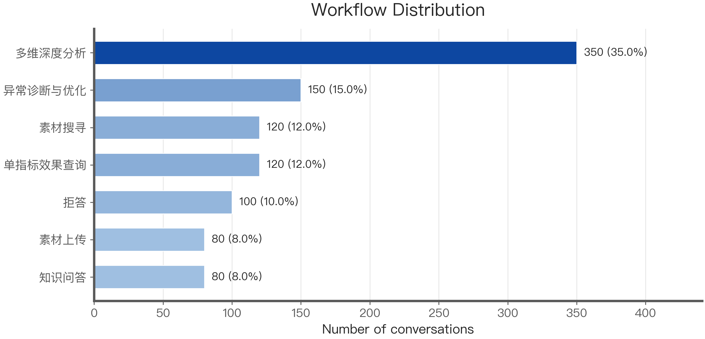
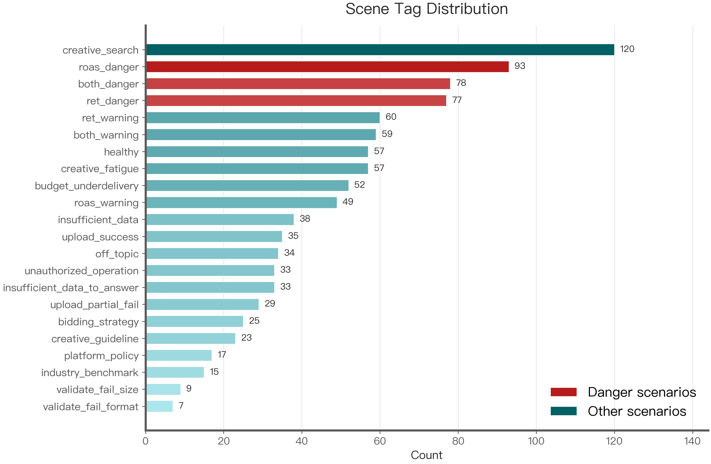
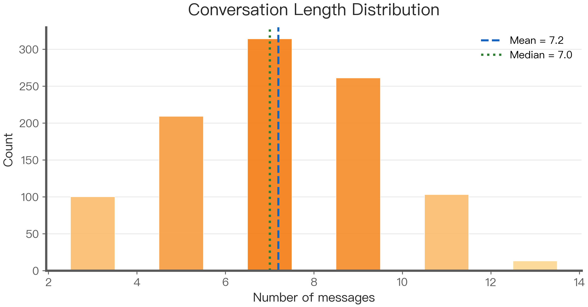
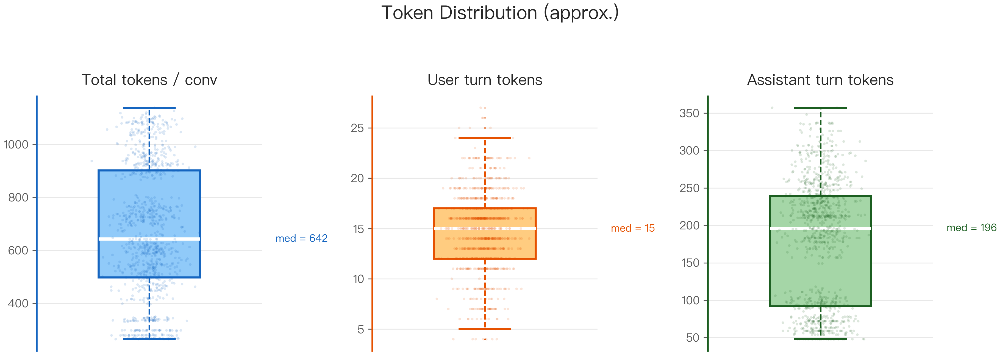
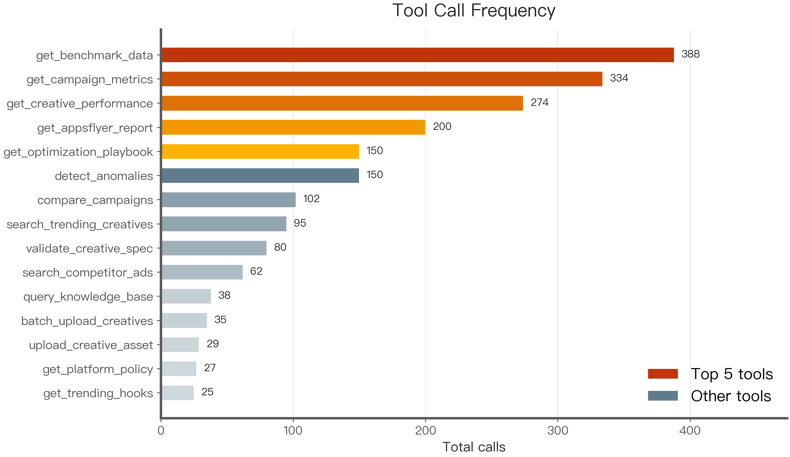
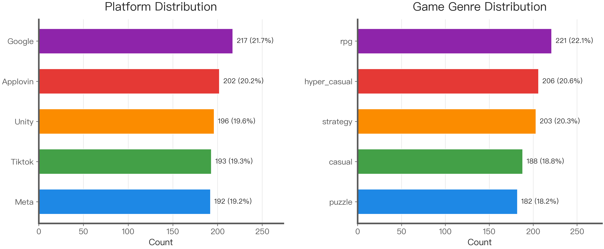

# Ad Campaign Agent SFT Dataset — Quality Report

> Generated: 2026-03-23 12:44
> Source file: `ad_agent_sft_20260323_124056_zh_sharegpt.json`
> Format detected: **SHAREGPT** → normalized to OpenAI Messages

---

## 📋 Overview

| Metric | Value |
|--------|-------|
| Total conversations | **1,000** |
| Input format | SHAREGPT |
| With tool calls | 900 (90.0%) |
| With clarification turn | 108 (10.8%) |
| Refusal conversations | 100 (10.0%) |
| Unique tools covered | 15 |
| Distinct scene tags | 22 |
| Format errors | ✅ 0 — clean |
| Platforms | Applovin, Google, Meta, Tiktok, Unity |
| Game genres | casual, hyper_casual, puzzle, rpg, strategy |

---

## 1. Workflow Distribution

| Workflow | Count | % |
|----------|------:|--:|
| 多维深度分析 | 350 | 35.0% |
| 异常诊断与优化 | 150 | 15.0% |
| 单指标效果查询 | 120 | 12.0% |
| 素材搜寻 | 120 | 12.0% |
| 拒答 | 100 | 10.0% |
| 知识问答 | 80 | 8.0% |
| 素材上传 | 80 | 8.0% |

---

## 2. Scene Tag Distribution

| Scene Tag | Count | % |
|-----------|------:|--:|
| `creative_search` | 120 | 12.0% |
| `roas_danger` | 93 | 9.3% |
| `both_danger` | 78 | 7.8% |
| `ret_danger` | 77 | 7.7% |
| `ret_warning` | 60 | 6.0% |
| `both_warning` | 59 | 5.9% |
| `creative_fatigue` | 57 | 5.7% |
| `healthy` | 57 | 5.7% |
| `budget_underdelivery` | 52 | 5.2% |
| `roas_warning` | 49 | 4.9% |
| `insufficient_data` | 38 | 3.8% |
| `upload_success` | 35 | 3.5% |
| `off_topic` | 34 | 3.4% |
| `unauthorized_operation` | 33 | 3.3% |
| `insufficient_data_to_answer` | 33 | 3.3% |
| `upload_partial_fail` | 29 | 2.9% |
| `bidding_strategy` | 25 | 2.5% |
| `creative_guideline` | 23 | 2.3% |
| `platform_policy` | 17 | 1.7% |
| `industry_benchmark` | 15 | 1.5% |
| `validate_fail_size` | 9 | 0.9% |
| `validate_fail_format` | 7 | 0.7% |

---

## 3. Conversation Length

| Stat | Value |
|------|-------|
| Min | 3 turns |
| Max | 13 turns |
| Mean | 7.19 turns |
| Median | 7.0 turns |
| Std dev | 2.36 |
| p25 | 5 |
| p75 | 9 |
| p90 | 11 |

---

## 4. Token Distribution (approx)

> Estimation method: Chinese characters ≈ 1 token/char, English ≈ 1 token/4 chars

| Scope | Min | Mean | Median | p90 | Max |
|-------|----:|-----:|-------:|----:|----:|
| Total / conv | 264 | 671 | 642 | 1027 | 1138 |
| User turns | 4 | 15 | 15 | 19 | 27 |
| Assistant turns | 48 | 178 | 196 | 279 | 357 |

---

## 5. Tool Call Statistics

### Tool Chain Length

| Chain Length | Count | % |
|-------------|------:|--:|
| 0 tool(s) | 100 | 10.0% |
| 1 tool(s) | 251 | 25.1% |
| 2 tool(s) | 296 | 29.6% |
| 3 tool(s) | 266 | 26.6% |
| 4 tool(s) | 87 | 8.7% |

### Individual Tool Call Frequency

| Tool | Calls | % of tool-call convs |
|------|------:|---------------------:|
| `get_benchmark_data` | 388 | 43.1% |
| `get_campaign_metrics` | 334 | 37.1% |
| `get_creative_performance` | 274 | 30.4% |
| `get_appsflyer_report` | 200 | 22.2% |
| `detect_anomalies` | 150 | 16.7% |
| `get_optimization_playbook` | 150 | 16.7% |
| `compare_campaigns` | 102 | 11.3% |
| `search_trending_creatives` | 95 | 10.6% |
| `validate_creative_spec` | 80 | 8.9% |
| `search_competitor_ads` | 62 | 6.9% |
| `query_knowledge_base` | 38 | 4.2% |
| `batch_upload_creatives` | 35 | 3.9% |
| `upload_creative_asset` | 29 | 3.2% |
| `get_platform_policy` | 27 | 3.0% |
| `get_trending_hooks` | 25 | 2.8% |

### Top 15 Tool Chain Combinations

| Chain | Count |
|-------|------:|
| `compare_campaigns → get_benchmark_data` | 102 |
| `(no tools)` | 100 |
| `get_campaign_metrics → get_appsflyer_report → get_creative_p...` | 87 |
| `get_campaign_metrics → get_creative_performance → get_benchm...` | 85 |
| `get_appsflyer_report → get_campaign_metrics → get_benchmark_...` | 76 |
| `detect_anomalies → get_creative_performance → get_optimizati...` | 57 |
| `detect_anomalies → get_campaign_metrics → get_optimization_p...` | 48 |
| `get_creative_performance` | 45 |
| `detect_anomalies → get_optimization_playbook` | 45 |
| `get_campaign_metrics` | 38 |
| `search_competitor_ads → search_trending_creatives` | 37 |
| `get_appsflyer_report` | 37 |
| `validate_creative_spec → batch_upload_creatives` | 35 |
| `search_trending_creatives` | 33 |
| `validate_creative_spec → upload_creative_asset` | 29 |

---

## 6. Platform & Genre Diversity

### Platform

| Platform | Count | % |
|----------|------:|--:|
| Google | 217 | 21.7% |
| Applovin | 202 | 20.2% |
| Unity | 196 | 19.6% |
| Tiktok | 193 | 19.3% |
| Meta | 192 | 19.2% |

### Game Genre

| Genre | Count | % |
|-------|------:|--:|
| rpg | 221 | 22.1% |
| hyper_casual | 206 | 20.6% |
| strategy | 203 | 20.3% |
| casual | 188 | 18.8% |
| puzzle | 182 | 18.2% |

---

## 7. Last Turn Type Distribution

| Turn Type | Count | % |
|-----------|------:|--:|
| `assistant_text` | 1000 | 100.0% |

---

## 8. Format Validation

| Check | Result |
|-------|--------|
| tool_call_id pairing | ✅ All matched |
| Last turn non-empty | ✅ OK |
| System message first | ✅ OK |

---

*Report generated by `3_dataquality_check.py`*
