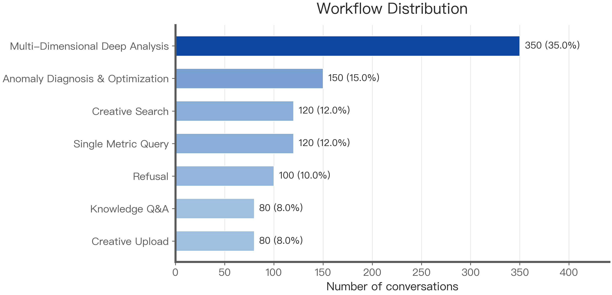
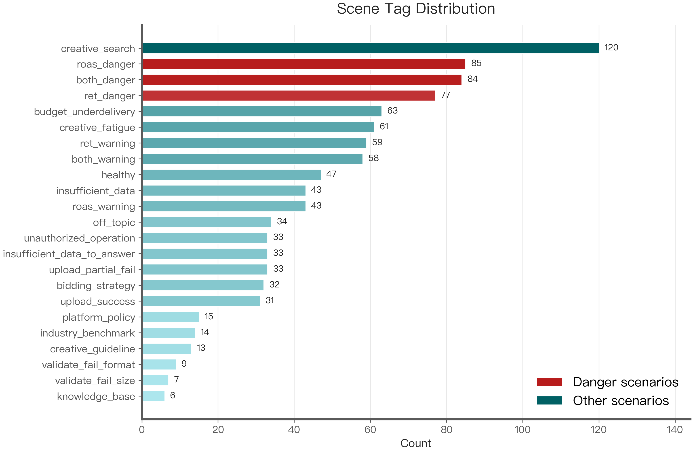
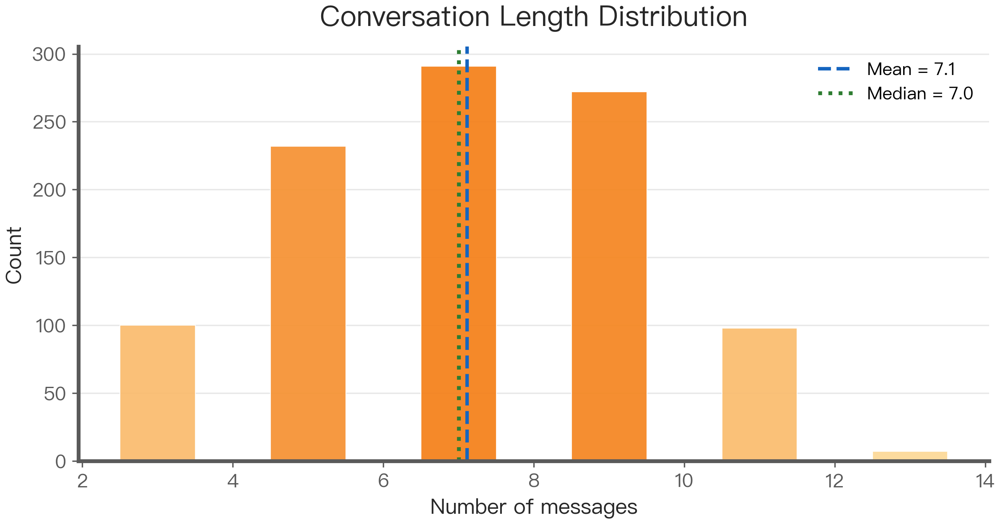
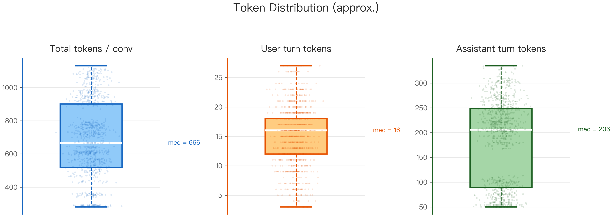
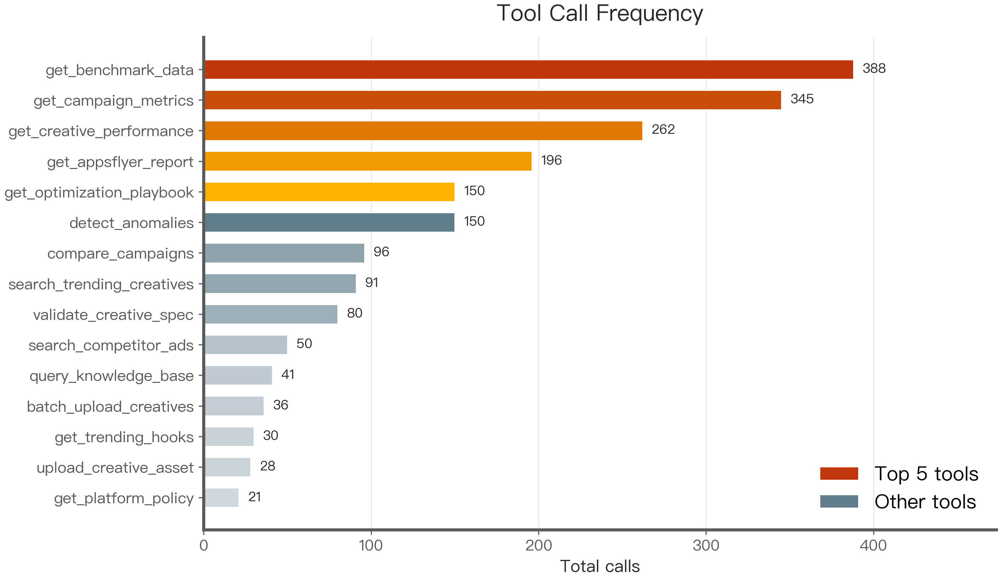
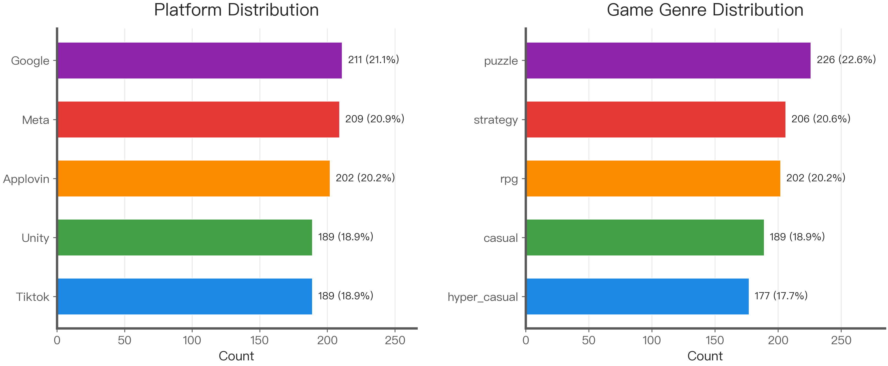

# Ad Campaign Agent SFT Dataset — Quality Report

> Generated: 2026-03-23 12:44
> Source file: `ad_agent_sft_20260323_124228_en_message.json`
> Format detected: **OPENAI** → normalized to OpenAI Messages

---

## 📋 Overview

| Metric | Value |
|--------|-------|
| Total conversations | **1,000** |
| Input format | OPENAI |
| With tool calls | 900 (90.0%) |
| With clarification turn | 93 (9.3%) |
| Refusal conversations | 100 (10.0%) |
| Unique tools covered | 15 |
| Distinct scene tags | 23 |
| Format errors | ✅ 0 — clean |
| Platforms | Applovin, Google, Meta, Tiktok, Unity |
| Game genres | casual, hyper_casual, puzzle, rpg, strategy |

---

## 1. Workflow Distribution

| Workflow | Count | % |
|----------|------:|--:|
| Multi-Dimensional Deep Analysis | 350 | 35.0% |
| Anomaly Diagnosis & Optimization | 150 | 15.0% |
| Single Metric Query | 120 | 12.0% |
| Creative Search | 120 | 12.0% |
| Refusal | 100 | 10.0% |
| Creative Upload | 80 | 8.0% |
| Knowledge Q&A | 80 | 8.0% |

---

## 2. Scene Tag Distribution

| Scene Tag | Count | % |
|-----------|------:|--:|
| `creative_search` | 120 | 12.0% |
| `roas_danger` | 85 | 8.5% |
| `both_danger` | 84 | 8.4% |
| `ret_danger` | 77 | 7.7% |
| `budget_underdelivery` | 63 | 6.3% |
| `creative_fatigue` | 61 | 6.1% |
| `ret_warning` | 59 | 5.9% |
| `both_warning` | 58 | 5.8% |
| `healthy` | 47 | 4.7% |
| `roas_warning` | 43 | 4.3% |
| `insufficient_data` | 43 | 4.3% |
| `off_topic` | 34 | 3.4% |
| `unauthorized_operation` | 33 | 3.3% |
| `insufficient_data_to_answer` | 33 | 3.3% |
| `upload_partial_fail` | 33 | 3.3% |
| `bidding_strategy` | 32 | 3.2% |
| `upload_success` | 31 | 3.1% |
| `platform_policy` | 15 | 1.5% |
| `industry_benchmark` | 14 | 1.4% |
| `creative_guideline` | 13 | 1.3% |
| `validate_fail_format` | 9 | 0.9% |
| `validate_fail_size` | 7 | 0.7% |
| `knowledge_base` | 6 | 0.6% |

---

## 3. Conversation Length

| Stat | Value |
|------|-------|
| Min | 3 turns |
| Max | 13 turns |
| Mean | 7.11 turns |
| Median | 7.0 turns |
| Std dev | 2.33 |
| p25 | 5 |
| p75 | 9 |
| p90 | 11 |

---

## 4. Token Distribution (approx)

> Estimation method: Chinese characters ≈ 1 token/char, English ≈ 1 token/4 chars

| Scope | Min | Mean | Median | p90 | Max |
|-------|----:|-----:|-------:|----:|----:|
| Total / conv | 281 | 680 | 666 | 1008 | 1131 |
| User turns | 3 | 15 | 16 | 21 | 27 |
| Assistant turns | 50 | 181 | 206 | 285 | 335 |

---

## 5. Tool Call Statistics

### Tool Chain Length

| Chain Length | Count | % |
|-------------|------:|--:|
| 0 tool(s) | 100 | 10.0% |
| 1 tool(s) | 265 | 26.5% |
| 2 tool(s) | 282 | 28.2% |
| 3 tool(s) | 277 | 27.7% |
| 4 tool(s) | 76 | 7.6% |

### Individual Tool Call Frequency

| Tool | Calls | % of tool-call convs |
|------|------:|---------------------:|
| `get_benchmark_data` | 388 | 43.1% |
| `get_campaign_metrics` | 345 | 38.3% |
| `get_creative_performance` | 262 | 29.1% |
| `get_appsflyer_report` | 196 | 21.8% |
| `detect_anomalies` | 150 | 16.7% |
| `get_optimization_playbook` | 150 | 16.7% |
| `compare_campaigns` | 96 | 10.7% |
| `search_trending_creatives` | 91 | 10.1% |
| `validate_creative_spec` | 80 | 8.9% |
| `search_competitor_ads` | 50 | 5.6% |
| `query_knowledge_base` | 41 | 4.6% |
| `batch_upload_creatives` | 36 | 4.0% |
| `get_trending_hooks` | 30 | 3.3% |
| `upload_creative_asset` | 28 | 3.1% |
| `get_platform_policy` | 21 | 2.3% |

### Top 15 Tool Chain Combinations

| Chain | Count |
|-------|------:|
| `(no tools)` | 100 |
| `compare_campaigns → get_benchmark_data` | 96 |
| `get_campaign_metrics → get_creative_performance → get_benchm...` | 94 |
| `get_appsflyer_report → get_campaign_metrics → get_benchmark_...` | 84 |
| `get_campaign_metrics → get_appsflyer_report → get_creative_p...` | 76 |
| `detect_anomalies → get_optimization_playbook` | 51 |
| `detect_anomalies → get_campaign_metrics → get_optimization_p...` | 50 |
| `detect_anomalies → get_creative_performance → get_optimizati...` | 49 |
| `get_creative_performance` | 43 |
| `get_campaign_metrics` | 41 |
| `search_trending_creatives` | 40 |
| `get_appsflyer_report` | 36 |
| `validate_creative_spec → batch_upload_creatives` | 36 |
| `search_trending_creatives → get_trending_hooks` | 30 |
| `search_competitor_ads` | 29 |

---

## 6. Platform & Genre Diversity

### Platform

| Platform | Count | % |
|----------|------:|--:|
| Google | 211 | 21.1% |
| Meta | 209 | 20.9% |
| Applovin | 202 | 20.2% |
| Tiktok | 189 | 18.9% |
| Unity | 189 | 18.9% |

### Game Genre

| Genre | Count | % |
|-------|------:|--:|
| puzzle | 226 | 22.6% |
| strategy | 206 | 20.6% |
| rpg | 202 | 20.2% |
| casual | 189 | 18.9% |
| hyper_casual | 177 | 17.7% |

---

## 7. Last Turn Type Distribution

| Turn Type | Count | % |
|-----------|------:|--:|
| `assistant_text` | 1000 | 100.0% |

---

## 8. Format Validation

| Check | Result |
|-------|--------|
| tool_call_id pairing | ✅ All matched |
| Last turn non-empty | ✅ OK |
| System message first | ✅ OK |

---

*Report generated by `3_dataquality_check.py`*
